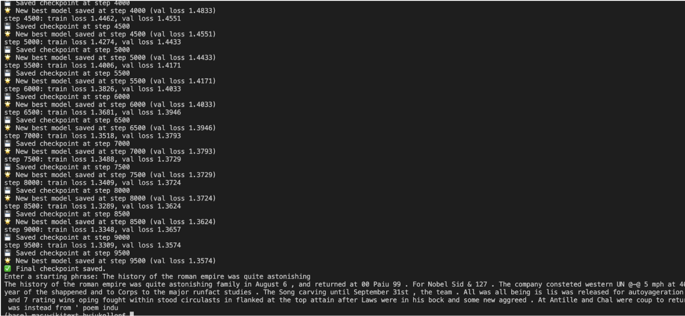
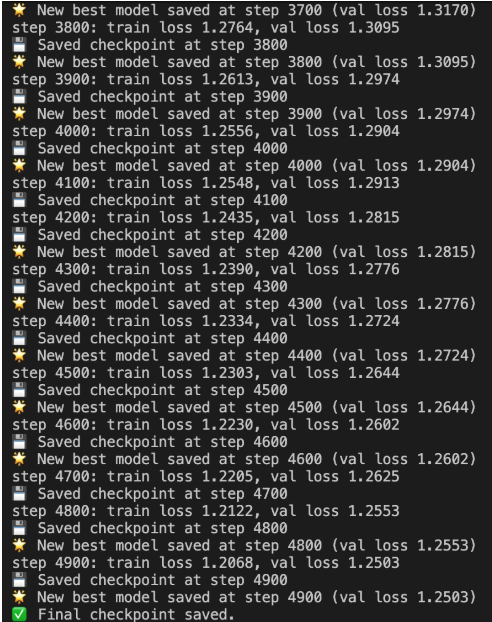
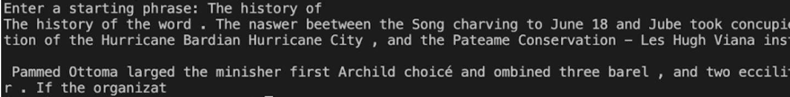
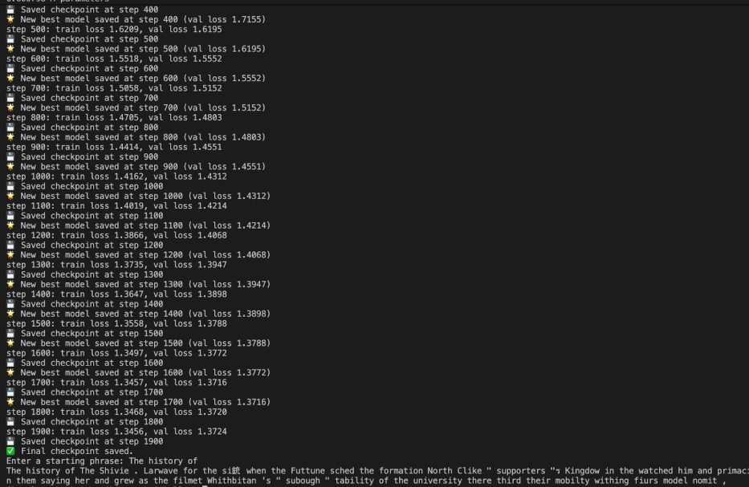

# Version 1 Experiments

This document details experiments for **v1.0 → v1.2**, including training setup, hyperparameters, logs, results, and qualitative observations.

---

## v1.0 — Baseline Character Tokenization

### Hyperparameters

```python
batch_size = 16
block_size = 128
max_iters = 5000
eval_interval = 500
learning_rate = 3e-4
device = 'cuda' if torch.cuda.is_available() else 'cpu'
eval_iters = 200
n_embd = 128
n_head = 4
n_layer = 4
dropout = 0.2
```

### Training Performance

- No detailed metrics were recorded
- This run primarily serves as an initial baseline to make sure the training pipeline works end to end

### Observations

- Model trained without major runtime issues.
- No qualitative evaluation or quantitative logging performed.
- Functioned as a sanity check before more systematic experiments in later versions.

## v1.1 — Scaled Embedding Layers and training time

### Hyperparameters

```python
batch_size = 16
block_size = 256
max_iters = 10000
eval_interval = 500
learning_rate = 3e-4
device = "mps" if torch.backends.mps.is_available() else "cpu"
eval_iters = 200
n_embd = 256
n_head = 8
n_layer = 6
dropout = 0.2
```

### Training Performance

- Best validation loss: **1.3574**
- Best training loss: **1.3309**
- Training loss started to slowly drift away from validation loss, should maybe increase dropout

### Training Log



### Observations

> _The model was able to generate many real English words, showing that character-level tokenization allowed it to piece together recognizable vocabulary. However, the output lacked coherent sentence structure, instead producing a stream of loosely related phrases. This indicates early success in forming words, but highlights the difficulty of scaling character-level models to produce meaningful syntax._

## v1.1 - Retested with longer context length

### Hyperparameters

```python
batch_size = 64
block_size = 512
max_iters = 5000
eval_interval = 500
learning_rate = 3e-4
device = "mps" if torch.backends.mps.is_available() else "cpu"
eval_iters = 200
n_embd = 256
n_head = 8
n_layer = 6
dropout = 0.2
```

### Training Performance

- Best validation loss: **1.2503**
- Best training loss: **1.2068**
- hit 1.47 val loss in 2000 training iterations
- Stopped after 5000 iterations
- Training loss started to slowly drift away from validation loss

### Training Log




### Observations

> _The model continues to generate real English words, but this time there were bigger phrases that were connected. The output mimics sort of a sentence structure with commas and periods (though there are spaces before and after them, showing that the model doesn't fully understand them yet). It makes sense that this change would happen because a longer context window allows for the model to train on real sentences isntead of smaller phrases._

## v1.2 - Adding ALiBi and GeLU to character tokenization

### Hyperparameters

```python
batch_size = 64
block_size = 512
max_iters = 2000
eval_interval = 100
learning_rate = 3e-4
device = "mps" if torch.backends.mps.is_available() else "cpu"
eval_iters = 200
n_embd = 256
n_head = 8
n_layer = 6
dropout = 0.2
```

### Training Performance

- Best validation loss: **1.3724**
- Best training loss: **1.3456**
- Hit 1.45 in 900 training iterations
- plateaued way earlier, stopped at 2000 iterations

### Training Log



### Observations

> _The model started performing worse and performing worse earlier. There were still some valid words but most weren't and ther was zero phrasing. We might have not been able to see the full capability of ALiBi because of the short context length. 512 context window looks like the lower end of the spectrum for ALiBi_

## References

- [ALiBi: Train Short, Test Long](https://arxiv.org/abs/2108.12409)
- [Gaussian Error Linear Units (GeLU)](https://arxiv.org/abs/1606.08415)
