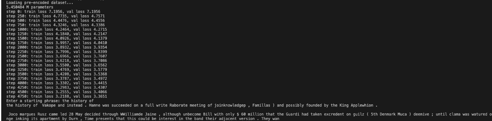
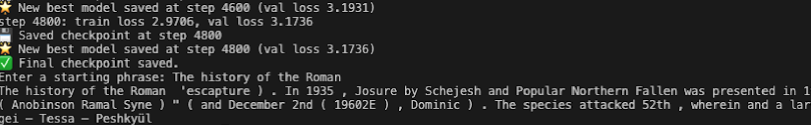
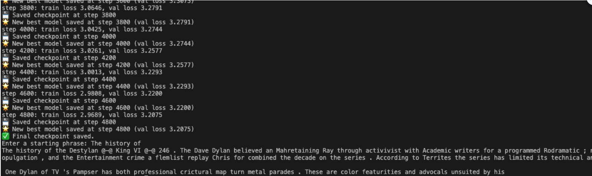
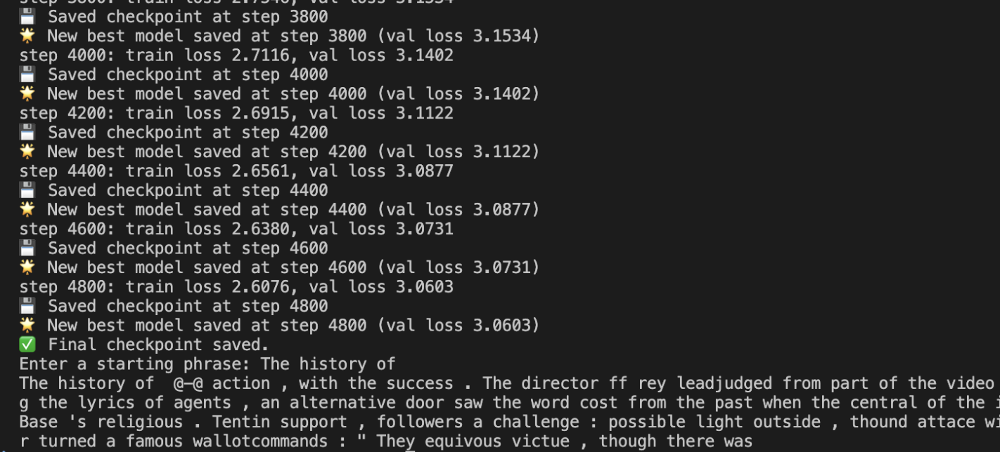
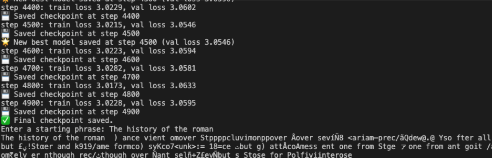
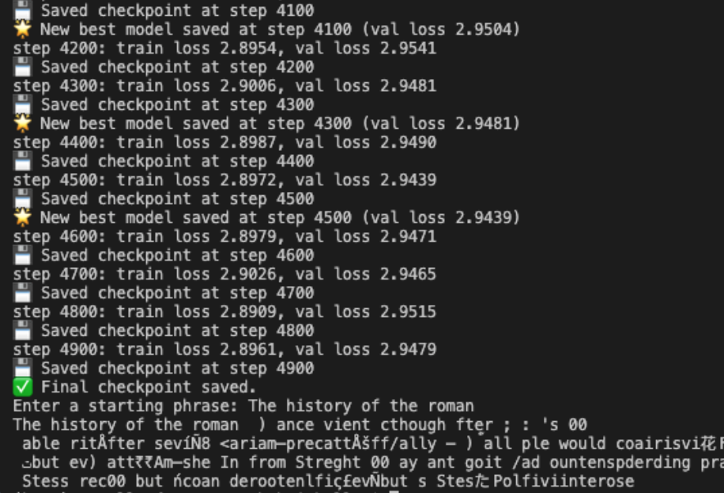
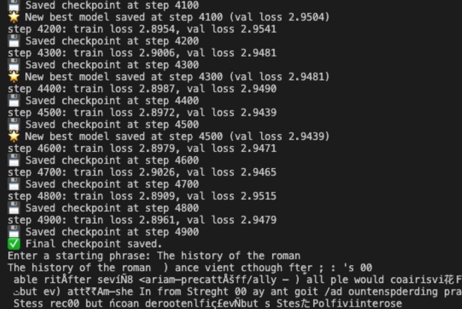

# Version 2 Experiments

This document details experiments for **v2.0 → v2.4**, including training setup, hyperparameters, logs, results, and qualitative observations.
All version 2 models revolve around Byte Pair Encoding **(BPE)** tokenization and the consecutive versions are just modifcations to the parameters, vocab size, or other variables. Additionally, to save time the Bytes in BPE were trained on only the first 200,000 characters.

## v2.0 — Baseline BPE using 1000 words

### Hyperparameters

```python
batch_size = 16
block_size = 128
max_iters = 5000
eval_interval = 250
learning_rate = 3e-4
device = "mps" if torch.backends.mps.is_available() else "cpu"
eval_iters = 200
n_embd = 256
n_head = 4
n_layer = 4
dropout = 0.2
```

### Training Performance

- Best validation loss: **3.3651**
- Best training loss: **3.2188**
- The training loss is miles away from the validation loss, maybe increase dropout
  - but also experiment more on BPE before making too many changes

### Training Log



### Observations

> _Obviously this version will be good at writing whole words because it has a vocabulary, however, none of these words were remotely the order to build phrases. There is some evidence of sentence structure because of periods and commas, however, I think there is something fundementally wrong with this because spaces always precede and follow. Additionally, this model has higher loss values because using words instead of characters and there are a lot more possible words than the words that are stored in the vocab list._

## v2.1 — Scaled BPE

### Hyperparameters

```python
batch_size = 16
block_size = 256
max_iters = 5000
eval_interval = 200
learning_rate = 3e-4
device = "mps" if torch.backends.mps.is_available() else "cpu"
eval_iters = 200
n_embd = 384
n_head = 6
n_layer = 6
dropout = 0.2
```

### Training Performance

- Best validation loss: **3.1736**
- Best training loss: **2.9706**
- Should definitely increase the dropout
- Not as big of an improvement with scaling yet

### Training Log



### Observations

> _I think the model is starting to sound a little more wikipedia like, however, this inference had too many "(" and ")" and also random " and ' scattered around. These were usually present with a date within them such as "(December 2nd)" and "(19602E)" (maybe trying to be like 1960 BC or something) which shows that maybe the model is starting to understand how to mark/quote dates, which is a big improvement on before._

## v2.2 - RoPE + Gelu

### Hyperparameters

```python
batch_size = 32
block_size = 256
max_iters = 5000
eval_interval = 200
learning_rate = 3e-4
device = "mps" if torch.backends.mps.is_available() else "cpu"
eval_iters = 200
n_embd = 256
n_head = 8
n_layer = 6
dropout = 0.2
```

### Training Performance

- Best validation loss: **3.2075**
- Best training loss: **2.9689**
- Training loss started is pretty far from validation loss

### Training Log



### Observations

> _Now there is not as much random fluff with the parenthesis and other clutter, except for the start. But after it got moving, it works pretty well and there are definetly phrases forming like the ones present in the character tokenization. However, there is still a problem with how the model deals with periods as a space still surrounds them._

## v2.3 - Learning Rate scheduler and Maxed out hyperparameters

### Hyperparameters

```python
batch_size = 32
block_size = 512
max_iters = 5000
eval_interval = 200
learning_rate = 3e-4
device = "mps" if torch.backends.mps.is_available() else "cpu"
eval_iters = 200
n_embd = 384
n_head = 8
n_layer = 6
dropout = 0.2
```

### Training Performance

- Best validation loss: **3.0603**
- Best training loss: **2.6076**
- NEED to increase the dropout or do something because the training loss is too far from the validation loss

### Training Log



### Observations

> _It looks likes smaller phrases are coming together, however, there still lies a critical problem on the punctuation. The problem with the punctuation probably lies within how the tokenization is done._

## v2.4 - Using 500 words vocabulary instead of 1000

### Hyperparameters

```python
batch_size = 32
block_size = 128
max_iters = 5000
eval_interval = 100
learning_rate = 3e-4
device = "mps" if torch.backends.mps.is_available() else "cpu"
eval_iters = 200
n_embd = 128
n_head = 4
n_layer = 4
dropout = 0.25
```

### Training Performance

#### dropout = 0.25

- Best validation loss: **3.0595**
- Best training loss: **3.0228**
- Kind of plateaued around 4000 iterations
- the validation loss and training loss are finally closer

#### dropout = 0.1

- Best validation loss: **2.9479**
- Best training loss: **2.8961**
- Still plateaued around 4000 iterations
- validation and training loss are still at an acceptable margin

### Training Log

#### dropout = 0.25



#### dropout = 0.1



### Observations

> _The smaller vocabulary size made the model horrendous. This is likely happening because there are too many words unaccounted for since our vocabulary size is limited to only the 500 most common character chunks._

## v2.4 - 500 words model scaled

### Hyperparameters

```python
batch_size = 32
block_size = 256
max_iters = 5000
eval_interval = 100
learning_rate = 3e-4
device = "mps" if torch.backends.mps.is_available() else "cpu"
eval_iters = 200
n_embd = 256
n_head = 6
n_layer = 6
dropout = 0.1
```

### Training Performance

- Best validation loss: **2.3690**
- Best training loss: **2.5650**
- Definetly overfitted, should have used a 0.2 dropout instead

### Training Log



### Observations

> _Definetly slightly better, however, we aren't even seeing real words anymore, like not even a single real word. 500 words is probably just too small of a vocabulary size._

## References

- [ALiBi: Train Short, Test Long](https://arxiv.org/abs/2108.12409)
- [Gaussian Error Linear Units (GeLU)](https://arxiv.org/abs/1606.08415)
