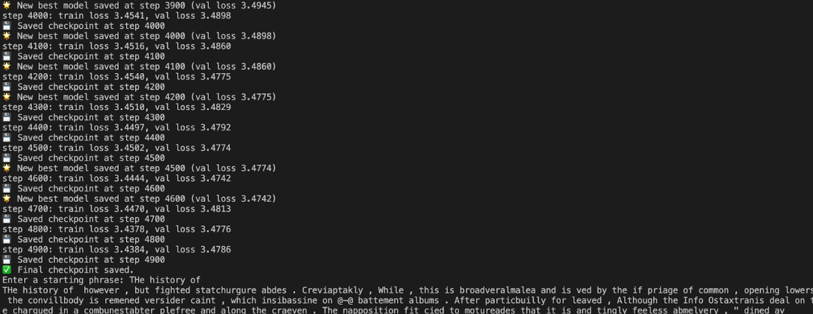
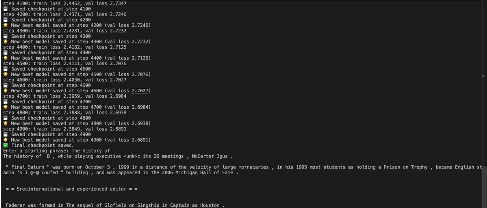
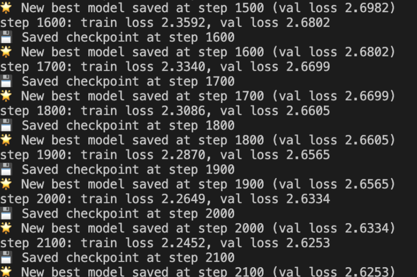
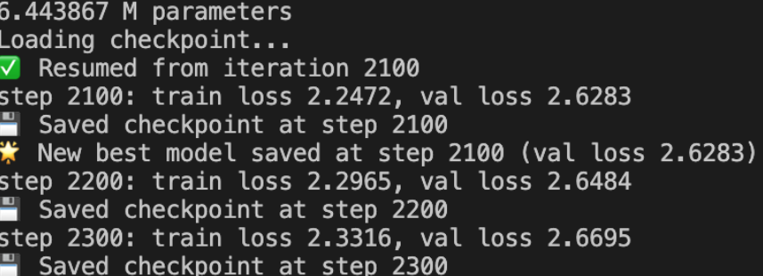
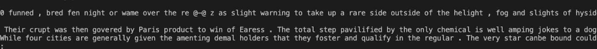

# Version 3 Experiments

This document details experiments for **v3.0 → v3.1**, including training setup, hyperparameters, logs, results, and qualitative observations.
All version 3 models revolve around only using the English vocabulary and some other special symbols. Every other unknown symbol is by default given the `<unk>`. BPE is still being used, 500 words, but the words and characters are only English, more specifically they are the first 102 characters of the ordered set.

## Other Experiments

- **[v1: Transformer baseline](results/v1.md)**
- **[v2: BPE Tokenization](results/v2.md)**
- **[v2: BPE Tokenization with an English only vocabulary](results/v3.md)**

## v3.0 — Baseline English BPE, first 102 characters, 500 words

### Hyperparameters

```python
batch_size = 32
block_size = 128
max_iters = 5000
eval_interval = 100
learning_rate = 3e-4
device = "mps" if torch.backends.mps.is_available() else "cpu"
eval_iters = 200
n_embd = 128
n_head = 4
n_layer = 4
dropout = 0.1
```

### Training Performance

- **1.2 million params**
- Best validation loss: **3.4786**
- Best training loss: **3.4384**
- No overfitting

### Training Log



### Observations

> _Smaller model, so obviously isn't going to have any insane results, however, most of the words look like some other language like German or something, but there is still some sentence structure and phrasing despite the actual words being completely wrong._

## v3.0 - Scaled

### Hyperparameters

```python
batch_size = 64
block_size = 256
max_iters = 5000
eval_interval = 100
learning_rate = 3e-4
device = "mps" if torch.backends.mps.is_available() else "cpu"
eval_iters = 200
n_embd = 256
n_head = 6
n_layer = 6
dropout = 0.1
```

### Training Performance

- **6.37 million params**
- Best validation loss: **2.6891**
- Best training loss: **2.3849**
- Should definitely increase the dropout, overfitting is happening quite a bit

### Training Log



### Observations

> _This model performed drastically better than the preivous one, it has solid sentence structure and pretty good phrases that have actual meaning. The sentences still don't have much going on and it is still confused with paragraphs and stuff. The main problem I still face is the problem with the spaces enveloping punctuations._

## v3.1 - Switching out RoPE with ALiBi

### Hyperparameters

```python
batch_size = 64
block_size = 128
max_iters = 5000
eval_interval = 100
learning_rate = 3e-4
device = "mps" if torch.backends.mps.is_available() else "cpu"
eval_iters = 200
n_embd = 128
n_head = 4
n_layer = 4
dropout = 0.1
```

### Training Performance

- Best validation loss: **3.0591**
- Best training loss: **2.9587**
- Overfitting is at a manageable place

### Training Log


### Observations

> _This model is getting similar results to v3.0 scaled without being scaled to that many parameters, so it defintetly has potential. There are slightly more `<unk>` and non existent words in this version. However, overall it is starting to get a solid grasp of phrasing. _

## v3.1 - Scaled

### Hyperparameters

```python
batch_size = 64
block_size = 512
max_iters = 5000
eval_interval = 100
learning_rate = 3e-4
device = "mps" if torch.backends.mps.is_available() else "cpu"
eval_iters = 200
n_embd = 256
n_head = 6
n_layer = 6
dropout = 0.1
```

### Training Performance

- Best validation loss: **2.6253**
- Best training loss: **2.2452**
- NEED to increase the dropout or do something because the training loss is too far from the validation loss
- Training plataeued a lot earlier at around 2000 iterations instead of the usual 5000

### Training Log





### Observations

> _This model is definetly the best out of all the models. I think if you look at the inference from afar, it somewhat looks like real writing (except for the spaces around the punctuation). Even when looking at is closely, it loosely resembles real writing with sentences that may not make logical sense, but they still follow general sentence structure such as "article + subject + verb + article + object + preposition+ object" or something like that. Now, the model just needs to get a better understanding of the words it uses as I think sentence structure is almost there (at least in a basic sense)_

## v3.2 - Change to 1000 words and Scaffold BPE

### Hyperparameters

```python
TBD
```

### Training Performance

TBD

### Training Log

TBD

### Observations

TBD

## References

- [Scaffold-BPE: Enhancing Byte Pair Encoding for Large Language Models with Simple and Effective Scaffold Token Removal](https://arxiv.org/abs/2404.17808)
