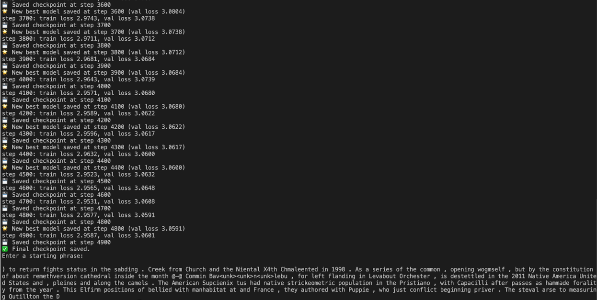

# Version 3 Experiments

This document details experiments for **v3.0 → v3.1**, including training setup, hyperparameters, logs, results, and qualitative observations.
All version 3 models revolve around only using the English vocabulary and some other special symbols. Every other unknown symbol is by default given the `<unk>`. BPE is still being used, 500 words, but the words and characters are only English, more specifically they are the first 102 characters of the ordered set.

## v3.0 — Baseline English BPE, first 102 characters, 500 words

### Hyperparameters

```python
batch_size = 32
block_size = 128
max_iters = 5000
eval_interval = 100
learning_rate = 3e-4
device = "mps" if torch.backends.mps.is_available() else "cpu"
eval_iters = 200
n_embd = 128
n_head = 4
n_layer = 4
dropout = 0.1
```

### Training Performance

- **1.2 million params**
- Best validation loss: **3.4786**
- Best training loss: **3.4384**
- No overfitting

### Training Log


### Observations

> _Smaller model, so obviously isn't going to have any insane results, however, most of the words look like some other language like German or something, but there is still some sentence structure and phrasing despite the actual words being completely wrong._

## v3.0 - Scaled

### Hyperparameters

```python
batch_size = 64
block_size = 256
max_iters = 5000
eval_interval = 100
learning_rate = 3e-4
device = "mps" if torch.backends.mps.is_available() else "cpu"
eval_iters = 200
n_embd = 256
n_head = 6
n_layer = 6
dropout = 0.1
```

### Training Performance

- **6.37 million params**
- Best validation loss: **2.6891**
- Best training loss: **2.3849**
- Should definitely increase the dropout, overfitting is happening quite a bit

### Training Log


### Observations

> _I think the model is starting to sound a little more wikipedia like, however, this inference had too many "(" and ")" and also random " and ' scattered around. These were usually present with a date within them such as "(December 2nd)" and "(19602E)" (maybe trying to be like 1960 BC or something) which shows that maybe the model is starting to understand how to mark/quote dates, which is a big improvement on before._

## v3.1 - Switching out RoPE with ALiBi

### Hyperparameters

```python
batch_size = 64
block_size = 128
max_iters = 5000
eval_interval = 100
learning_rate = 3e-4
device = "mps" if torch.backends.mps.is_available() else "cpu"
eval_iters = 200
n_embd = 128
n_head = 4
n_layer = 4
dropout = 0.1
```

### Training Performance

- Best validation loss: **3.0591**
- Best training loss: **2.9587**
- Overfitting is at a manageable place

### Training Log



### Observations

> _Now there is not as much random fluff with the parenthesis and other clutter, except for the start. But after it got moving, it works pretty well and there are definetly phrases forming like the ones present in the character tokenization. However, there is still a problem with how the model deals with periods as a space still surrounds them._

## v3.1 - Scaled

### Hyperparameters

```python
batch_size = 64
block_size = 512
max_iters = 5000
eval_interval = 100
learning_rate = 3e-4
device = "mps" if torch.backends.mps.is_available() else "cpu"
eval_iters = 200
n_embd = 256
n_head = 6
n_layer = 6
dropout = 0.1
```

### Training Performance

- Best validation loss: **2.6253**
- Best training loss: **2.2452**
- NEED to increase the dropout or do something because the training loss is too far from the validation loss
- Training plataeued a lot earlier at around 2000 iterations instead of the usual 5000

### Training Log


### Observations

> _It looks likes smaller phrases are coming together, however, there still lies a critical problem on the punctuation. The problem with the punctuation probably lies within how the tokenization is done._

## v2.4 - Use 1k words and scaffold BPE

### Hyperparameters

```python
TBD
```

### Training Performance

TBD

### Training Log

TBD

### Observations

TBD

## References

- [ALiBi: Train Short, Test Long](https://arxiv.org/abs/2108.12409)
- [Gaussian Error Linear Units (GeLU)](https://arxiv.org/abs/1606.08415)
